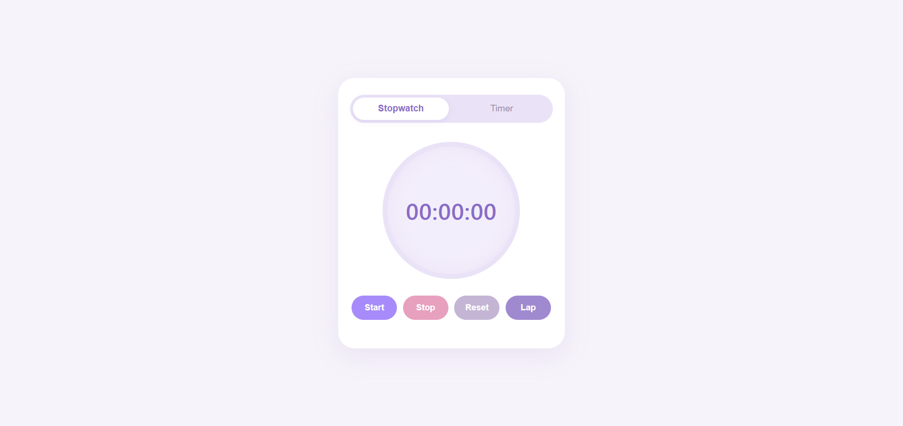

# Stopwatch & Timer ⏱️

A simple and responsive time tracking app built with **HTML, CSS, and JavaScript**.

The project includes both a stopwatch and a countdown timer, with a clean and minimal interface.

## ✨ Features

* Stopwatch with:

  * Start, Stop, and Reset controls
  * Lap recording
  * Lap time and total time display
* Countdown Timer with:

  * Custom hours, minutes, and seconds
  * Start, Stop, and Reset controls
* Switch between Stopwatch and Timer modes
* Responsive design for mobile and desktop
* Clean and minimal interface
* Smooth button interactions

## 🛠️ Built With

* HTML5
* CSS3
* JavaScript
* CSS Variables
* DOM Manipulation
* Responsive Design

## 📸 Screenshots




## 🌐 Live Demo

[View Live Demo](https://elenahedayat.github.io/timer-stopwatch/)

## 📁 Project Structure

```text
stopwatch-timer/
│
├── index.html
├── style.css
├── script.js
└── README.md
```

## 🚀 How to Run

1. Clone the repository:

```bash
git clone https://github.com/elenahedayat/timer-stopwatch.git
```

2. Open the project folder.
3. Open `index.html` in your browser.

No additional installation or dependencies are required.

## 👩‍💻 Author

**Elena Hedayat**

[GitHub](https://github.com/elenahedayat)
